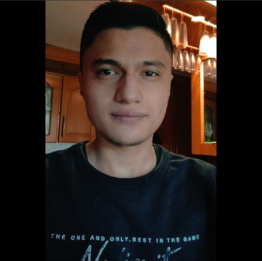

# Triangulo-Tecnologico
**Taller-1**: Presentacion taller 1 por parte del triangulo tecnologico.

## Mateo Maldonado Diaz
Ingeniero de sistemas en sexto semestre, tiene 21 años y le gustan los videojuegos y el futbol.

## Edward Andres Quintero Palma
Ingeniero de sistemas y hace doble con finanzas, tiene 20 años y le gusta el futsal y la moto velocidad.

## Nicolas Hincapie
Ingeniero de sistemas en sexto semestre, tiene 20 años y le gustan los instrumentos y el futbol.

